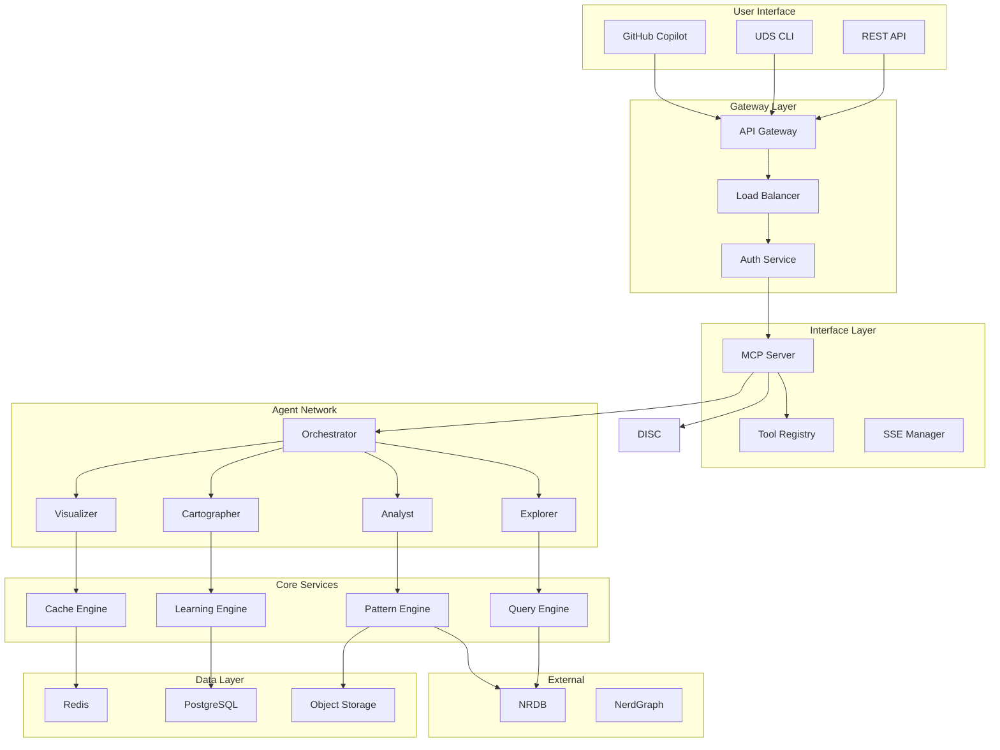
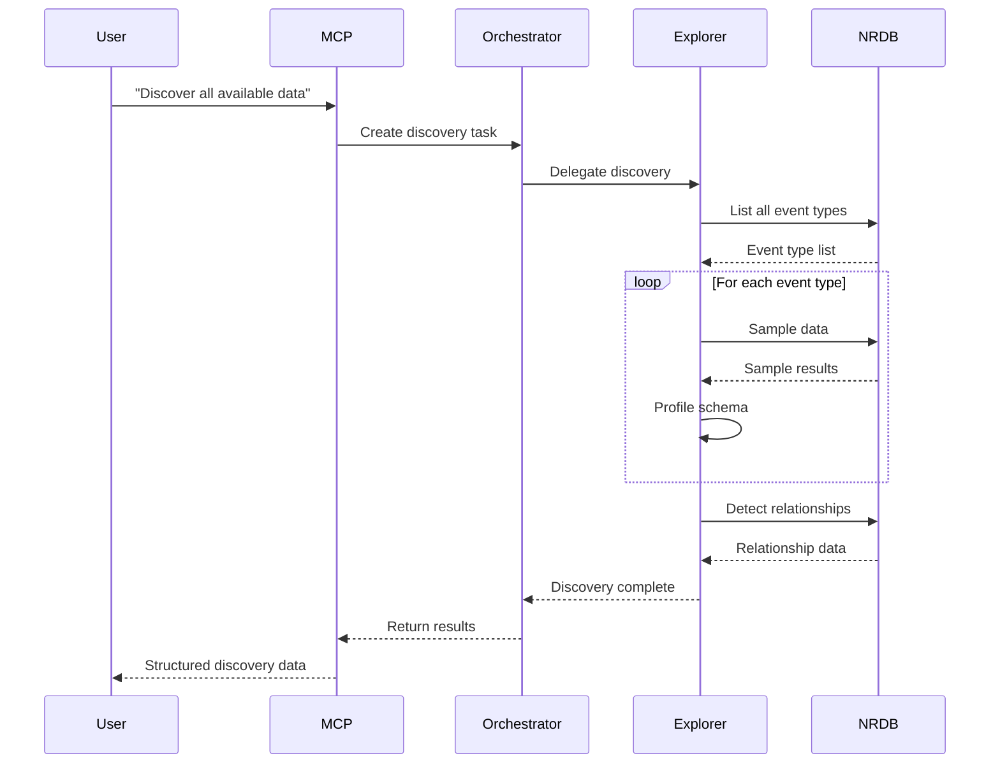
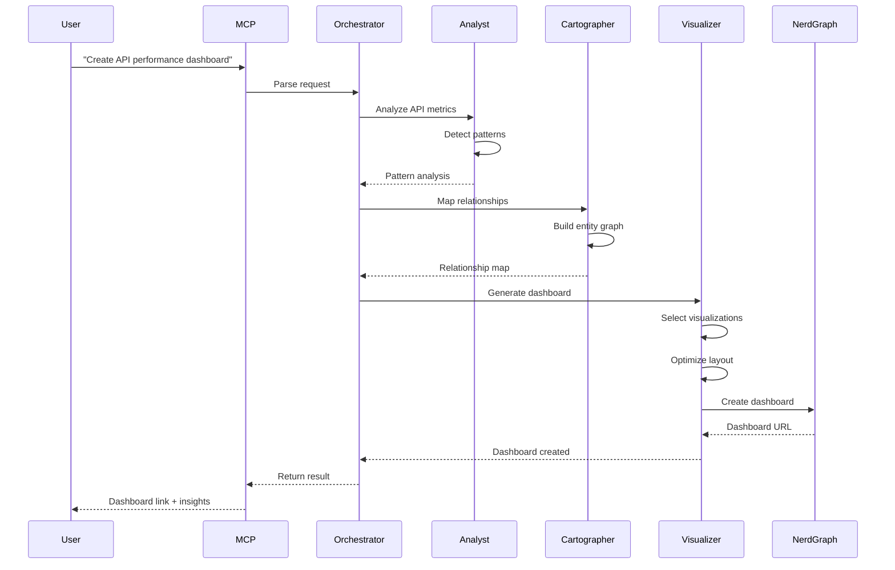

# Universal Data Synthesizer - Complete Architecture Documentation

## Table of Contents
1. [System Overview](#1-system-overview)
2. [Core Components](#2-core-components)
3. [MCP Integration](#3-mcp-integration)
4. [Agent Development](#4-agent-development)
5. [Data Flow & Communication](#5-data-flow--communication)
6. [Security Architecture](#6-security-architecture)
7. [Deployment Architecture](#7-deployment-architecture)
8. [Performance & Scalability](#8-performance--scalability)
9. [Monitoring & Observability](#9-monitoring--observability)
10. [Development Guide](#10-development-guide)

---

## 1. System Overview

The Universal Data Synthesizer (UDS) is a distributed, agent-based system designed to automatically discover, analyze, and visualize data from New Relic's NRDB. It follows MCP (Model Context Protocol) and A2A (Agent-to-Agent) standards to ensure interoperability with AI assistants like GitHub Copilot.

### 1.1 Architecture Principles

1. **Agent-Based Design**: Specialized agents handle specific tasks (discovery, analysis, visualization)
2. **Standards Compliance**: Full MCP/A2A compatibility for AI assistant integration
3. **Zero-Knowledge Discovery**: No prior configuration needed to understand data
4. **Production-First**: Built for scale, security, and reliability from day one
5. **Continuous Learning**: Every interaction improves future performance

### 1.2 High-Level Architecture



---

## 2. Core Components

### 2.1 MCP Server

The MCP server is the primary interface for AI assistants to interact with UDS.

```python
# src/uds/mcp/server.py
from mcp import Server, Tool, Transport
from mcp.types import TextContent, ImageContent, ProgressContent
import asyncio
from typing import AsyncGenerator

class UDSMCPServer(Server):
    """
    MCP server implementation following the Model Context Protocol specification
    """
    
    def __init__(self, config: MCPConfig):
        self.config = config
        self.tool_registry = ToolRegistry()
        self.session_manager = SessionManager()
        self.stream_manager = StreamManager()
        
        # Initialize tools
        self._register_tools()
        
    def _register_tools(self):
        """Register all available tools with metadata"""
        tools = [
            DiscoverSchemaTool(),
            AnalyzePatternsTool(),
            GenerateQueryTool(),
            CreateDashboardTool(),
            OptimizeQueryTool(),
            DetectAnomaliesTool(),
            MapRelationshipsTool(),
            GenerateInsightsTool()
        ]
        
        for tool in tools:
            self.tool_registry.register(tool)
    
    async def handle_tool_call(self, request: ToolRequest) -> ToolResponse:
        """Handle incoming tool calls with streaming support"""
        # Validate request
        if not self.validate_request(request):
            return ToolResponse(error="Invalid request")
        
        # Get or create session
        session = self.session_manager.get_or_create(request.session_id)
        
        # Execute tool with streaming
        tool = self.tool_registry.get(request.tool_name)
        
        async for update in tool.execute_with_stream(request.params, session):
            if update.type == StreamType.PROGRESS:
                await self.stream_manager.send_progress(
                    request.session_id, 
                    update
                )
            elif update.type == StreamType.PARTIAL_RESULT:
                await self.stream_manager.send_partial(
                    request.session_id,
                    update
                )
        
        # Return final result
        return ToolResponse(
            result=tool.get_final_result(),
            session_id=session.id
        )
```

### 2.2 Agent Network

Each agent is a specialized microservice that handles specific aspects of the data synthesis workflow.

#### Orchestrator Agent

```python
# src/uds/agents/orchestrator.py
class OrchestratorAgent(BaseAgent):
    """
    Main coordinator that manages workflow execution
    """
    
    def __init__(self):
        super().__init__("orchestrator")
        self.workflow_engine = WorkflowEngine()
        self.decision_engine = DecisionEngine()
        self.delegation_engine = DelegationEngine()
        
    async def execute_workflow(self, goal: str, context: Context) -> WorkflowResult:
        """Execute a complete workflow based on user goal"""
        
        # Create execution plan
        plan = self.workflow_engine.create_plan(goal, context)
        
        # Initialize workflow state
        state = WorkflowState(plan=plan, context=context)
        
        # Execute workflow steps
        while not state.is_complete():
            # Get next action from decision engine
            decision = self.decision_engine.decide_next(state)
            
            # Select appropriate agent
            agent = self.delegation_engine.select_agent(decision)
            
            # Create task for agent
            task = self.create_task(decision, state)
            
            # Delegate to specialist agent
            result = await self.delegate_to_agent(agent, task)
            
            # Update state
            state.update(result)
            
            # Check if user input needed
            if result.requires_user_input:
                user_response = await self.request_user_input(
                    result.user_prompt
                )
                state.add_user_input(user_response)
        
        return state.get_final_result()
```

#### Explorer Agent

```python
# src/uds/agents/explorer.py
class ExplorerAgent(BaseAgent):
    """
    Discovers and profiles data schemas with zero prior knowledge
    """
    
    def __init__(self):
        super().__init__("explorer")
        self.discovery_engine = DiscoveryEngine()
        self.sampling_engine = SamplingEngine()
        self.profiling_engine = ProfilingEngine()
        
    async def discover_schemas(self, context: DiscoveryContext) -> DiscoveryResult:
        """Discover all available schemas in NRDB"""
        
        # Phase 1: Initial discovery
        schemas = await self.discovery_engine.scan_all_schemas()
        
        # Phase 2: Intelligent sampling
        for schema in schemas:
            # Determine sampling strategy
            strategy = self.sampling_engine.select_strategy(schema)
            
            # Execute sampling
            samples = await self.sampling_engine.sample(schema, strategy)
            
            # Profile the schema
            profile = await self.profiling_engine.profile(schema, samples)
            
            schema.attach_profile(profile)
        
        # Phase 3: Detect relationships
        relationships = await self.discovery_engine.detect_relationships(schemas)
        
        # Phase 4: Assess quality
        quality_scores = await self.assess_data_quality(schemas)
        
        return DiscoveryResult(
            schemas=schemas,
            relationships=relationships,
            quality_scores=quality_scores,
            metadata=self.generate_metadata(schemas)
        )
```

### 2.3 Core Engines

#### Query Engine

```python
# src/uds/engines/query.py
class QueryEngine:
    """
    Generates and optimizes NRQL queries
    """
    
    def __init__(self):
        self.generator = QueryGenerator()
        self.optimizer = QueryOptimizer()
        self.validator = QueryValidator()
        self.cost_estimator = CostEstimator()
        
    async def generate_query(self, intent: str, context: QueryContext) -> Query:
        """Generate optimized query from natural language intent"""
        
        # Parse intent
        parsed_intent = self.parse_intent(intent)
        
        # Generate base query
        base_query = self.generator.generate(parsed_intent, context)
        
        # Validate query
        validation = self.validator.validate(base_query)
        if not validation.is_valid:
            raise QueryValidationError(validation.errors)
        
        # Estimate cost
        cost = self.cost_estimator.estimate(base_query)
        
        # Optimize if needed
        if cost.is_expensive:
            optimized = self.optimizer.optimize(base_query, cost)
            return optimized
        
        return base_query
```

#### Pattern Engine

```python
# src/uds/engines/pattern.py
class PatternEngine:
    """
    Detects patterns in time series and event data
    """
    
    def __init__(self):
        self.temporal_detector = TemporalPatternDetector()
        self.correlation_detector = CorrelationDetector()
        self.anomaly_detector = AnomalyDetector()
        self.business_detector = BusinessPatternDetector()
        
    async def analyze_patterns(self, data: DataStream) -> PatternAnalysis:
        """Comprehensive pattern analysis"""
        
        patterns = []
        
        # Detect different pattern types in parallel
        results = await asyncio.gather(
            self.temporal_detector.detect(data),
            self.correlation_detector.detect(data),
            self.anomaly_detector.detect(data),
            self.business_detector.detect(data)
        )
        
        # Combine and rank patterns
        all_patterns = [p for result in results for p in result]
        ranked_patterns = self.rank_by_significance(all_patterns)
        
        # Generate insights
        insights = self.generate_insights(ranked_patterns)
        
        return PatternAnalysis(
            patterns=ranked_patterns,
            insights=insights,
            confidence_scores=self.calculate_confidence(ranked_patterns)
        )
```

---

## 3. Interface Layer & MCP Integration

### 3.1 Interface Layer Architecture

The Interface Layer provides unified access to UDS through multiple protocols:

```go
// pkg/interface/architecture.go
/*
┌─────────────────────────────────────────────────────────────────┐
│                        Interface Layer                           │
├─────────────────────────────────────────────────────────────────┤
│  ┌──────────────┐  ┌──────────────┐  ┌───────────────────────┐ │
│  │  MCP Server  │  │  REST API    │  │    CLI Tool           │ │
│  │ (JSON-RPC)   │  │  (OpenAPI)   │  │    (Cobra)            │ │
│  └──────────────┘  └──────────────┘  └───────────────────────┘ │
│                                                                  │
│  ┌─────────────────────────────────────────────────────────────┐│
│  │              Shared Components                               ││
│  │  SSE Manager | Auth/Rate Limiter | Request Transformer      ││
│  └─────────────────────────────────────────────────────────────┘│
└─────────────────────────────────────────────────────────────────┘
*/
```

### 3.2 MCP Server Configuration

```json
// ~/.config/github-copilot/mcp.json
{
  "servers": {
    "uds": {
      "command": "uds",
      "args": ["mcp", "--transport", "stdio"],
      "env": {
        "UDS_API_KEY": "${UDS_API_KEY}",
        "NEW_RELIC_API_KEY": "${NEW_RELIC_API_KEY}"
      },
      "metadata": {
        "name": "Universal Data Synthesizer",
        "description": "AI-powered New Relic dashboard creation",
        "version": "2.0.0",
        "author": "New Relic"
      }
    }
  }
}
```

### 3.3 MCP Tool Implementation (Go)

```go
// pkg/mcp/tools.go
package mcp

// Tool represents an MCP tool
type Tool struct {
    Name        string
    Description string
    Parameters  ToolParameters
    Handler     ToolHandler
    Streaming   bool
}

// Discovery tool example
var DiscoveryListSchemas = Tool{
    Name:        "discovery.list_schemas",
    Description: "List all available schemas in the data source",
    Parameters: ToolParameters{
        Type: "object",
        Properties: map[string]Property{
            "filter": {
                Type:        "string",
                Description: "Optional filter for schema names",
            },
            "include_quality": {
                Type:        "boolean",
                Description: "Include quality metrics",
                Default:     false,
            },
        },
    },
    Handler: handleListSchemas,
}

// Dashboard creation with streaming
var DashboardCreate = Tool{
    Name:        "dashboard.create",
    Description: "Create a complete dashboard from requirements",
    Parameters: ToolParameters{
        Type: "object",
        Required: []string{"goal"},
        Properties: map[string]Property{
            "goal": {
                Type:        "string",
                Description: "Dashboard goal or requirement",
            },
            "style": {
                Type:        "string",
                Description: "Dashboard style (executive, technical, operational)",
                Default:     "auto",
            },
        },
    },
    Handler:   handleCreateDashboard,
    Streaming: true,
}
```

### 3.4 Transport Support

```go
// pkg/mcp/transport.go
package mcp

// Multiple transport options for flexibility
type Transport interface {
    Start(ctx context.Context, handler MessageHandler) error
    Send(message []byte) error
    Close() error
}

// StdioTransport for CLI integration
type StdioTransport struct {
    reader *bufio.Reader
    writer io.Writer
}

// HTTPTransport for web-based tools
type HTTPTransport struct {
    server *http.Server
}

// SSETransport for real-time streaming
type SSETransport struct {
    connections sync.Map
}
```

### 3.5 Streaming & Progress Tracking

```go
// pkg/streaming/sse_manager.go
package streaming

// SSEManager handles real-time event streaming
type SSEManager struct {
    connections sync.Map
    events      chan Event
}

// ProgressTracker for long-running operations
type ProgressTracker struct {
    manager    *SSEManager
    jobID      string
    totalSteps int
}

func (t *ProgressTracker) Update(step int, message string) {
    progress := float64(step) / float64(t.totalSteps) * 100
    
    t.manager.BroadcastJobEvent(t.jobID, EventTypeProgress, map[string]interface{}{
        "step":     step,
        "total":    t.totalSteps,
        "progress": progress,
        "message":  message,
    })
}

// Example usage in dashboard creation
func (s *Server) handleCreateDashboard(ctx context.Context, params map[string]interface{}) {
    tracker := NewProgressTracker(jobID, 5)
    
    // Phase 1: Discovery
    tracker.Update(1, "Discovering relevant schemas...")
    schemas := s.discoverSchemas(ctx, params["goal"])
    
    // Phase 2: Analysis
    tracker.Update(2, "Analyzing data patterns...")
    patterns := s.analyzePatterns(ctx, schemas)
    
    // Phase 3: Query Generation
    tracker.Update(3, "Generating optimized queries...")
    queries := s.generateQueries(ctx, patterns)
    
    // Phase 4: Dashboard Creation
    tracker.Update(4, "Creating dashboard widgets...")
    dashboard := s.createDashboard(ctx, queries)
    
    // Phase 5: Finalization
    tracker.Update(5, "Finalizing dashboard...")
    url := s.finalizeDashboard(ctx, dashboard)
    
    tracker.Complete(url)
}
```

---

## 4. Agent Development

### 4.1 Base Agent Architecture

```python
# src/uds/agents/base.py
from abc import ABC, abstractmethod
from typing import Dict, Any, Optional
import asyncio
import logging

class BaseAgent(ABC):
    """
    Base class for all UDS agents
    """
    
    def __init__(self, agent_id: str, capabilities: List[str]):
        self.agent_id = agent_id
        self.capabilities = capabilities
        self.logger = logging.getLogger(f"uds.agent.{agent_id}")
        
        # A2A components
        self.a2a_client = A2AClient(agent_id)
        self.task_queue = asyncio.Queue()
        self.running = False
        
        # Metrics
        self.metrics = AgentMetrics(agent_id)
        
        # Health
        self.health_checker = HealthChecker(self)
        
        # Initialize agent
        self._initialize()
    
    @abstractmethod
    def _initialize(self):
        """Initialize agent-specific components"""
        pass
    
    @abstractmethod
    async def handle_task(self, task: Task) -> TaskResult:
        """Handle incoming task"""
        pass
    
    async def start(self):
        """Start the agent"""
        self.running = True
        self.logger.info(f"Starting agent {self.agent_id}")
        
        # Publish agent card
        await self._publish_agent_card()
        
        # Start task processor
        asyncio.create_task(self._process_tasks())
        
        # Start health monitoring
        asyncio.create_task(self.health_checker.start())
        
        # Agent-specific startup
        await self._on_start()
    
    async def _process_tasks(self):
        """Process incoming tasks"""
        while self.running:
            try:
                # Get next task
                task = await asyncio.wait_for(
                    self.task_queue.get(),
                    timeout=1.0
                )
                
                # Record metric
                self.metrics.task_received()
                
                # Handle task
                with self.metrics.measure_task_duration():
                    result = await self.handle_task(task)
                
                # Send result
                await self.a2a_client.send_result(task.sender, result)
                
                # Record success
                self.metrics.task_completed()
                
            except asyncio.TimeoutError:
                continue
            except Exception as e:
                self.logger.error(f"Error processing task: {e}")
                self.metrics.task_failed()
```

### 4.2 A2A Communication Protocol

```python
# src/uds/a2a/protocol.py
from dataclasses import dataclass
from typing import Dict, Any, Optional
import uuid
import json
import hmac
import hashlib

@dataclass
class A2AMessage:
    """
    Standard A2A message format
    """
    id: str
    sender: str
    recipient: str
    type: str
    payload: Dict[str, Any]
    timestamp: datetime
    signature: Optional[str] = None
    
    def to_json(self) -> str:
        """Convert to JSON for transmission"""
        return json.dumps({
            "id": self.id,
            "sender": self.sender,
            "recipient": self.recipient,
            "type": self.type,
            "payload": self.payload,
            "timestamp": self.timestamp.isoformat(),
            "signature": self.signature
        })
    
    def sign(self, secret_key: str):
        """Sign the message"""
        message_bytes = self.to_json().encode()
        signature = hmac.new(
            secret_key.encode(),
            message_bytes,
            hashlib.sha256
        ).hexdigest()
        self.signature = signature
    
    def verify(self, secret_key: str) -> bool:
        """Verify message signature"""
        if not self.signature:
            return False
        
        # Calculate expected signature
        original_sig = self.signature
        self.signature = None
        expected_sig = self.sign(secret_key)
        self.signature = original_sig
        
        return self.signature == expected_sig
```

### 4.3 Creating a Custom Agent

```python
# src/uds/agents/examples/pattern_agent.py
from uds.agents.base import BaseAgent
from typing import Dict, Any, List
import numpy as np

class PatternDetectionAgent(BaseAgent):
    """
    Agent that detects patterns in metrics
    """
    
    def __init__(self):
        super().__init__(
            agent_id="pattern-detector",
            capabilities=["pattern_detection", "trend_analysis", "anomaly_detection"]
        )
        
    def _initialize(self):
        """Initialize pattern detection components"""
        self.pattern_detector = PatternDetector()
        self.trend_analyzer = TrendAnalyzer()
        self.anomaly_detector = AnomalyDetector()
    
    async def handle_task(self, task: Task) -> TaskResult:
        """Handle pattern detection tasks"""
        
        if task.type == "detect_patterns":
            return await self._detect_patterns(task.data)
        elif task.type == "analyze_trend":
            return await self._analyze_trend(task.data)
        elif task.type == "detect_anomalies":
            return await self._detect_anomalies(task.data)
        else:
            return TaskResult(
                success=False,
                error=f"Unknown task type: {task.type}"
            )
    
    async def _detect_patterns(self, data: Dict[str, Any]) -> TaskResult:
        """Detect patterns in time series data"""
        try:
            # Extract time series
            time_series = np.array(data["values"])
            timestamps = np.array(data["timestamps"])
            
            # Detect patterns
            patterns = []
            
            # Seasonal pattern detection
            seasonal = self.pattern_detector.detect_seasonality(
                time_series,
                timestamps
            )
            if seasonal:
                patterns.append({
                    "type": "seasonal",
                    "period": seasonal.period,
                    "strength": seasonal.strength,
                    "confidence": seasonal.confidence
                })
            
            # Trend detection
            trend = self.trend_analyzer.analyze(time_series)
            if trend.is_significant:
                patterns.append({
                    "type": "trend",
                    "direction": trend.direction,
                    "slope": trend.slope,
                    "r_squared": trend.r_squared
                })
            
            # Anomaly detection
            anomalies = self.anomaly_detector.detect(
                time_series,
                method="isolation_forest"
            )
            if anomalies:
                patterns.append({
                    "type": "anomalies",
                    "count": len(anomalies),
                    "indices": anomalies,
                    "severity": self._calculate_severity(anomalies, time_series)
                })
            
            return TaskResult(
                success=True,
                data={
                    "patterns": patterns,
                    "summary": self._generate_summary(patterns),
                    "recommendations": self._generate_recommendations(patterns)
                }
            )
            
        except Exception as e:
            self.logger.error(f"Pattern detection failed: {e}")
            return TaskResult(
                success=False,
                error=str(e)
            )
```

---

## 5. Data Flow & Communication

### 5.1 Discovery Flow



### 5.2 Dashboard Generation Flow



### 5.3 Session Management

```python
# src/uds/mcp/session.py
class SessionManager:
    """
    Manages MCP sessions for context preservation
    """
    
    def __init__(self, storage: SessionStorage):
        self.storage = storage
        self.active_sessions: Dict[str, Session] = {}
        self.cleanup_interval = 3600  # 1 hour
        
        # Start cleanup task
        asyncio.create_task(self.cleanup_loop())
    
    def get_or_create(self, session_id: Optional[str] = None) -> Session:
        """Get existing session or create new one"""
        if session_id and session_id in self.active_sessions:
            session = self.active_sessions[session_id]
            session.touch()  # Update last access time
            return session
        
        # Create new session
        session = Session(
            id=session_id or generate_session_id(),
            created_at=datetime.utcnow()
        )
        
        self.active_sessions[session.id] = session
        return session
    
    async def persist_session(self, session: Session):
        """Persist session to storage"""
        await self.storage.save(session)
    
    async def cleanup_loop(self):
        """Clean up inactive sessions"""
        while True:
            await asyncio.sleep(self.cleanup_interval)
            
            cutoff = datetime.utcnow() - timedelta(hours=24)
            inactive = [
                sid for sid, session in self.active_sessions.items()
                if session.last_access < cutoff
            ]
            
            for sid in inactive:
                await self.persist_session(self.active_sessions[sid])
                del self.active_sessions[sid]
```

---

## 6. Security Architecture

### 6.1 Multi-Tenant Isolation

```python
# src/uds/security/tenant.py
class TenantIsolationManager:
    """
    Enforces strict tenant isolation
    """
    
    def __init__(self):
        self.access_controller = AccessController()
        self.query_rewriter = QueryRewriter()
        self.audit_logger = AuditLogger()
        
    def apply_tenant_context(self, query: Query, tenant: Tenant) -> Query:
        """Apply tenant isolation to query"""
        
        # Add account filter
        isolated_query = self.query_rewriter.add_account_filter(
            query, 
            tenant.account_id
        )
        
        # Apply row-level security
        if tenant.has_rls_rules():
            isolated_query = self.apply_rls(isolated_query, tenant)
        
        # Apply data masking
        if tenant.has_masking_rules():
            isolated_query = self.apply_masking(isolated_query, tenant)
        
        # Log access
        self.audit_logger.log_query_access(
            tenant=tenant,
            original_query=query,
            isolated_query=isolated_query
        )
        
        return isolated_query
```

### 6.2 Authentication & Authorization

```python
# src/uds/security/auth.py
class AuthenticationManager:
    """
    Handles authentication for all access methods
    """
    
    def __init__(self):
        self.jwt_validator = JWTValidator()
        self.api_key_validator = APIKeyValidator()
        self.mcp_auth = MCPAuthenticator()
        
    async def authenticate_request(self, request: Request) -> AuthContext:
        """Authenticate incoming request"""
        
        # Check authentication method
        if auth_header := request.headers.get("Authorization"):
            if auth_header.startswith("Bearer "):
                return await self.authenticate_jwt(auth_header)
            elif auth_header.startswith("ApiKey "):
                return await self.authenticate_api_key(auth_header)
        
        # Check MCP authentication
        if mcp_token := request.headers.get("X-MCP-Token"):
            return await self.authenticate_mcp(mcp_token)
        
        raise AuthenticationError("No valid authentication provided")
```

### 6.3 Audit Logging

```python
# src/uds/security/audit.py
class AuditLogger:
    """
    Comprehensive audit logging for compliance
    """
    
    def __init__(self, storage: AuditStorage):
        self.storage = storage
        
    async def log_query_access(
        self,
        tenant: Tenant,
        user: User,
        query: Query,
        result: QueryResult
    ):
        """Log query access for audit trail"""
        
        entry = AuditEntry(
            timestamp=datetime.utcnow(),
            tenant_id=tenant.id,
            user_id=user.id,
            action="query_execution",
            resource=query.target,
            details={
                "query": query.to_dict(),
                "result_count": result.row_count,
                "execution_time": result.execution_time,
                "data_scanned": result.data_scanned
            }
        )
        
        await self.storage.store(entry)
```

---

## 7. Deployment Architecture

### 7.1 Docker Configuration

```dockerfile
# Dockerfile.mcp
FROM python:3.11-slim

WORKDIR /app

# Install dependencies
COPY requirements.txt .
RUN pip install --no-cache-dir -r requirements.txt

# Copy application
COPY src/ ./src/
COPY config/ ./config/

# Create non-root user
RUN useradd -m -u 1000 uds && chown -R uds:uds /app
USER uds

# Expose MCP port
EXPOSE 8080

# Health check
HEALTHCHECK --interval=30s --timeout=3s --start-period=40s \
  CMD curl -f http://localhost:8080/health || exit 1

# Start server
CMD ["python", "-m", "uds.mcp.main"]
```

### 7.2 Container Deployment

```yaml
# docker-compose.production.yml
version: '3.8'

services:
  orchestrator:
    image: uds/orchestrator:2.0.0
    deploy:
      replicas: 3
      resources:
        limits:
          cpus: '2.0'
          memory: 4G
        reservations:
          cpus: '1.0'
          memory: 2G
    ports:
      - "8080:8080"
      - "9090:9090"
    environment:
      - AGENT_ID=${HOSTNAME}
      - A2A_PRIVATE_KEY_FILE=/run/secrets/orchestrator-key
    secrets:
      - orchestrator-key
    healthcheck:
      test: ["CMD", "curl", "-f", "http://localhost:8080/health"]
      interval: 30s
      timeout: 3s
      retries: 3
      start_period: 40s
    volumes:
      - config:/etc/uds:ro
    networks:
      - uds-network

secrets:
  orchestrator-key:
    external: true

volumes:
  config:
    driver: local

networks:
  uds-network:
    driver: overlay
    attachable: true
```

### 7.3 Service Mesh Configuration

```yaml
# k8s/istio/virtual-service.yaml
apiVersion: networking.istio.io/v1beta1
kind: VirtualService
metadata:
  name: uds-routing
spec:
  hosts:
  - uds.newrelic.com
  gateways:
  - uds-gateway
  http:
  - match:
    - uri:
        prefix: /mcp
    route:
    - destination:
        host: uds-mcp-server
        port:
          number: 8080
      weight: 100
    timeout: 30s
    retries:
      attempts: 3
      perTryTimeout: 10s
  - match:
    - uri:
        prefix: /api
    route:
    - destination:
        host: uds-api-gateway
        port:
          number: 8080
      weight: 100
```

### 7.4 Production Deployment Checklist

```yaml
# deployment/production-checklist.yml
production_readiness:
  security:
    - [ ] A2A authentication configured
    - [ ] MCP tool permissions set
    - [ ] Tenant isolation tested
    - [ ] Rate limiting enabled
    - [ ] Audit logging active
    
  reliability:
    - [ ] Circuit breakers configured
    - [ ] Retry policies set
    - [ ] Checkpointing enabled
    - [ ] Graceful degradation tested
    - [ ] Chaos engineering passed
    
  performance:
    - [ ] Response time < 100ms for simple queries
    - [ ] Can handle 1000 concurrent sessions
    - [ ] Memory usage < 4GB per agent
    - [ ] Query optimization validated
    - [ ] Caching layers operational
    
  observability:
    - [ ] OpenTelemetry tracing active
    - [ ] Prometheus metrics exposed
    - [ ] Grafana dashboards created
    - [ ] Alert rules configured
    - [ ] SLOs defined and monitored
    
  deployment:
    - [ ] Blue-green deployment tested
    - [ ] Rollback procedures documented
    - [ ] Database migrations automated
    - [ ] Configuration management in place
    - [ ] Disaster recovery tested
```

---

## 8. Performance & Scalability

### 8.1 Caching Strategy

```python
# src/uds/cache/multi_tier.py
class MultiTierCache:
    """
    Multi-tier caching system for optimal performance
    """
    
    def __init__(self):
        # L1: In-memory cache (fastest, smallest)
        self.l1_cache = MemoryCache(max_size="1GB")
        
        # L2: Redis cache (fast, distributed)
        self.l2_cache = RedisCache(
            nodes=["redis-1:6379", "redis-2:6379"],
            replication=2
        )
        
        # L3: PostgreSQL cache (persistent, large)
        self.l3_cache = PostgresCache(
            connection_pool=create_pool(),
            table="cache_entries"
        )
        
    async def get(self, key: str) -> Optional[Any]:
        """Get from cache with fallthrough"""
        
        # Try L1
        if value := await self.l1_cache.get(key):
            return value
        
        # Try L2
        if value := await self.l2_cache.get(key):
            # Promote to L1
            await self.l1_cache.set(key, value, ttl=300)
            return value
        
        # Try L3
        if value := await self.l3_cache.get(key):
            # Promote to L2 and L1
            await self.l2_cache.set(key, value, ttl=3600)
            await self.l1_cache.set(key, value, ttl=300)
            return value
        
        return None
    
    async def set(self, key: str, value: Any, ttl: int = 3600):
        """Set in all cache tiers"""
        
        # Determine cache tiers based on value size and importance
        size = sys.getsizeof(value)
        
        # Always set in L3 (persistent)
        await self.l3_cache.set(key, value, ttl=ttl*24)  # 24x longer TTL
        
        # Set in L2 if reasonable size
        if size < 10_000_000:  # 10MB
            await self.l2_cache.set(key, value, ttl=ttl)
        
        # Set in L1 if small
        if size < 1_000_000:  # 1MB
            await self.l1_cache.set(key, value, ttl=min(ttl, 300))
```

### 8.2 Query Optimization

```python
# src/uds/optimization/query.py
class QueryOptimizer:
    """
    Optimizes NRQL queries for performance and cost
    """
    
    def __init__(self):
        self.cost_model = CostModel()
        self.rewriter = QueryRewriter()
        self.cache_advisor = CacheAdvisor()
        
    def optimize(self, query: Query, constraints: OptimizationConstraints) -> Query:
        """Optimize query based on constraints"""
        
        # Analyze query
        analysis = self.analyze_query(query)
        
        # Apply optimizations
        optimized = query
        
        # 1. Add appropriate time bounds
        if not analysis.has_time_bounds:
            optimized = self.add_time_bounds(optimized, constraints)
        
        # 2. Add sampling for high-volume data
        if analysis.estimated_rows > 1_000_000:
            optimized = self.add_sampling(optimized, constraints)
        
        # 3. Select only needed fields
        if analysis.uses_select_star:
            optimized = self.optimize_projections(optimized)
        
        # 4. Add caching hints
        cache_strategy = self.cache_advisor.recommend(optimized)
        optimized.cache_hint = cache_strategy
        
        # 5. Rewrite for performance
        optimized = self.rewriter.rewrite_for_performance(optimized)
        
        return optimized
```

### 8.3 Resource Management

```python
# src/uds/resources/manager.py
class ResourceManager:
    """
    Manages computational resources across the system
    """
    
    def __init__(self):
        self.scheduler = ResourceScheduler()
        self.monitor = ResourceMonitor()
        self.limiter = RateLimiter()
        
    async def allocate_resources(self, task: Task) -> ResourceAllocation:
        """Allocate resources for task execution"""
        
        # Estimate resource needs
        needs = self.estimate_needs(task)
        
        # Check availability
        available = await self.monitor.get_available_resources()
        
        # Wait if necessary
        if not self.can_allocate(needs, available):
            await self.wait_for_resources(needs)
        
        # Allocate
        allocation = self.scheduler.allocate(needs)
        
        # Set up monitoring
        self.monitor.track_allocation(allocation)
        
        # Set up cleanup
        asyncio.create_task(
            self.cleanup_on_completion(task, allocation)
        )
        
        return allocation
```

### 8.4 Learning Engine

```python
# src/uds/learning/feedback_loop.py
class ProductionLearningEngine:
    """
    Continuous learning from production usage
    """
    
    def __init__(self):
        self.pattern_store = PatternStore()
        self.decision_store = DecisionStore()
        self.outcome_analyzer = OutcomeAnalyzer()
        self.model_trainer = ModelTrainer()
        
    async def learn_from_session(self, session: Session):
        """
        Extract learnings from completed session
        """
        # Analyze decisions made
        decision_analysis = self.outcome_analyzer.analyze_decisions(
            session.decisions,
            session.outcome
        )
        
        # Update pattern confidence
        for pattern in session.used_patterns:
            if session.outcome.success:
                pattern.success_count += 1
            pattern.usage_count += 1
            pattern.confidence = pattern.success_count / pattern.usage_count
            await self.pattern_store.update(pattern)
        
        # Store successful paths
        if session.outcome.success:
            path = DecisionPath(
                goal_type=session.goal_type,
                decisions=session.decisions,
                outcome=session.outcome,
                context_features=session.extract_features()
            )
            await self.decision_store.store_success_path(path)
        
        # Retrain models if needed
        if self._should_retrain():
            await self.model_trainer.schedule_retraining()
    
    def get_recommendations(self, context: Context) -> List[Recommendation]:
        """
        Provide recommendations based on learned patterns
        """
        recommendations = []
        
        # Find similar successful sessions
        similar_sessions = self.decision_store.find_similar(context)
        
        for session in similar_sessions[:5]:
            recommendations.append(Recommendation(
                type="follow_pattern",
                description=f"Similar goal achieved in {session.duration}",
                confidence=session.similarity_score,
                suggested_path=session.decision_path
            ))
        
        # Suggest high-confidence patterns
        relevant_patterns = self.pattern_store.find_relevant(context)
        
        for pattern in relevant_patterns:
            if pattern.confidence > 0.8:
                recommendations.append(Recommendation(
                    type="use_pattern",
                    description=pattern.description,
                    confidence=pattern.confidence,
                    pattern_id=pattern.id
                ))
        
        return recommendations
```

---

## 9. Monitoring & Observability

### 9.1 Metrics Collection

```python
# src/uds/metrics/collector.py
class MetricsCollector:
    """
    Collects and exposes metrics for Prometheus
    """
    
    def __init__(self):
        # Counter metrics
        self.requests_total = Counter(
            'uds_requests_total',
            'Total number of requests',
            ['method', 'agent', 'status']
        )
        
        # Histogram metrics
        self.request_duration = Histogram(
            'uds_request_duration_seconds',
            'Request duration in seconds',
            ['method', 'agent']
        )
        
        # Gauge metrics
        self.active_sessions = Gauge(
            'uds_active_sessions',
            'Number of active sessions'
        )
        
        # Custom metrics
        self.discovery_schemas = Gauge(
            'uds_discovered_schemas_total',
            'Total number of discovered schemas'
        )
        
        self.pattern_detections = Counter(
            'uds_pattern_detections_total',
            'Total pattern detections',
            ['pattern_type', 'confidence']
        )
```

### 9.2 Distributed Tracing

```python
# src/uds/tracing/tracer.py
class DistributedTracer:
    """
    OpenTelemetry-based distributed tracing
    """
    
    def __init__(self):
        self.tracer = trace.get_tracer("uds")
        self.propagator = TraceContextTextMapPropagator()
        
    def start_span(self, name: str, attributes: Dict = None) -> Span:
        """Start a new span"""
        
        span = self.tracer.start_span(
            name,
            attributes=attributes or {}
        )
        
        # Add standard attributes
        span.set_attribute("service.name", "uds")
        span.set_attribute("service.version", __version__)
        
        return span
    
    def inject_context(self, headers: Dict) -> Dict:
        """Inject trace context for propagation"""
        
        self.propagator.inject(headers)
        return headers
    
    def extract_context(self, headers: Dict) -> Context:
        """Extract trace context from headers"""
        
        return self.propagator.extract(headers)
```

### 9.3 Self-Monitoring Dashboard

```nrql
# Agent usage dashboard
SELECT count(*) FROM AgentExecution
FACET workflow_type
SINCE 1 week ago

# Success rates
SELECT percentage(count(*), WHERE success = true)
FROM AgentExecution
FACET workflow_type
TIMESERIES

# Time savings
SELECT average(time_saved_minutes)
FROM AgentFeedback
WHERE time_saved_minutes > 0
FACET workflow_type

# Popular patterns
SELECT count(*) FROM AgentExecution
FACET initial_query_pattern
SINCE 1 day ago
LIMIT 20
```

---

## 10. Development Guide

### 10.1 Local Development Setup

```bash
# Clone repository
git clone https://github.com/newrelic/uds.git
cd uds

# Create virtual environment
python -m venv venv
source venv/bin/activate  # or venv\Scripts\activate on Windows

# Install dependencies
pip install -r requirements.txt
pip install -r requirements-dev.txt

# Set up environment variables
cp .env.example .env
# Edit .env with your credentials

# Run tests
pytest

# Start local MCP server
python -m uds.mcp.main --mode stdio --debug
```

### 10.2 Testing Strategy

```python
# tests/test_agent_integration.py
import pytest
from uds.agents.orchestrator import OrchestratorAgent
from uds.agents.specialists.explorer import ExplorerAgent

@pytest.mark.asyncio
async def test_agent_communication():
    """Test communication between agents"""
    
    # Create agents
    orchestrator = OrchestratorAgent()
    explorer = ExplorerAgent()
    
    # Start agents
    await orchestrator.start()
    await explorer.start()
    
    # Test delegation
    result = await orchestrator.delegate_to_agent(
        "explorer-001",
        "discover_all_schemas",
        {"filter": "Transaction"}
    )
    
    assert result.success
    assert "schemas" in result.data
    
    # Cleanup
    await orchestrator.stop()
    await explorer.stop()
```

### 10.3 CLI Integration

```python
# src/uds/cli/mcp_integration.py
import subprocess
import json
from pathlib import Path

class LocalMCPIntegration:
    """
    Integrate with VS Code Copilot via local MCP
    """
    
    def __init__(self):
        self.config_path = Path.home() / ".config" / "github-copilot" / "mcp.json"
        self.server_process = None
        
    def register_with_copilot(self):
        """
        Register UDS MCP server with GitHub Copilot
        """
        config = {
            "servers": {
                "uds": {
                    "command": "uds-mcp-server",
                    "args": ["--mode", "stdio"],
                    "description": "Universal Data Synthesizer",
                    "schema": self._generate_schema()
                }
            }
        }
        
        # Write config
        self.config_path.parent.mkdir(parents=True, exist_ok=True)
        with open(self.config_path, 'w') as f:
            json.dump(config, f, indent=2)
            
        print(f"✓ Registered with Copilot at {self.config_path}")
```

### 10.4 Example Copilot Interaction

```python
"""
Example: How GitHub Copilot uses UDS via MCP/A2A
"""

# In VS Code with Copilot Agent Mode enabled

# User: "@uds analyze our API performance and create a dashboard"

# Copilot initiates A2A task to Orchestrator
orchestrator_task = {
    "type": "create_dashboard",
    "goal": "analyze API performance",
    "context": {
        "user": "current_user",
        "workspace": "current_workspace"
    }
}

# Orchestrator creates session and starts discovery
# Updates stream back via MCP SSE:

# [Progress: Starting schema discovery...]
# [Progress: Found 23 schemas with data]
# [Progress: Analyzing Transaction schema - 2.3M records/hour]
# [Progress: Detected latency patterns - p95 increasing]
# [Progress: Found correlation with deployment events]

# Decision point - Copilot shows options:
# "I found increasing latency correlated with deployments. Should I:"
# 1. Deep dive into specific endpoints
# 2. Analyze deployment impact
# 3. Create performance regression dashboard

# User selects option 3

# [Progress: Generating optimized queries...]
# [Progress: Building dashboard layout...]
# [Progress: Adding deployment markers...]

# Final result:
# "✓ Dashboard created: API Performance Analysis"
# "Key insights:"
# - "Latency increased 23% after deployment #1234"
# - "Endpoint /api/checkout most affected"
# - "Suggested optimization: Add caching layer"
#
# View dashboard: [link]
```

### 10.5 Best Practices

#### Agent Design
```python
# Good: Single responsibility
class MetricValidatorAgent(BaseAgent):
    """Validates metric data quality"""
    
    def __init__(self):
        super().__init__(
            "metric-validator",
            ["validate_metrics", "check_quality"]
        )

# Bad: Too many responsibilities
class DoEverythingAgent(BaseAgent):
    """Does too much"""
    
    def __init__(self):
        super().__init__(
            "do-everything",
            ["discover", "analyze", "visualize", "optimize", "deploy"]
        )
```

#### Error Handling
```python
# Good: Specific error handling
async def handle_task(self, task: Task) -> TaskResult:
    try:
        # Validate input
        if not self._validate_task(task):
            return TaskResult(
                success=False,
                error="Invalid task parameters",
                error_code="INVALID_PARAMS"
            )
        
        # Process task
        result = await self._process_task(task)
        
        return TaskResult(
            success=True,
            data=result
        )
        
    except NRDBConnectionError as e:
        # Specific handling for NRDB errors
        self.logger.error(f"NRDB connection failed: {e}")
        return TaskResult(
            success=False,
            error="Failed to connect to NRDB",
            error_code="NRDB_CONNECTION_ERROR",
            retry=True
        )
        
    except Exception as e:
        # Generic error handling
        self.logger.exception("Unexpected error in task handling")
        return TaskResult(
            success=False,
            error="Internal error",
            error_code="INTERNAL_ERROR"
        )
```

#### Performance Optimization
```python
# Good: Async and batching
class OptimizedAgent(BaseAgent):
    async def handle_multiple_schemas(self, schemas: List[str]) -> Dict:
        # Process in batches
        batch_size = 10
        results = {}
        
        for i in range(0, len(schemas), batch_size):
            batch = schemas[i:i + batch_size]
            
            # Process batch in parallel
            batch_results = await asyncio.gather(
                *[self._process_schema(s) for s in batch],
                return_exceptions=True
            )
            
            # Collect results
            for schema, result in zip(batch, batch_results):
                if isinstance(result, Exception):
                    results[schema] = {"error": str(result)}
                else:
                    results[schema] = result
        
        return results
```

---

## Conclusion

The Universal Data Synthesizer architecture is designed to be:

1. **Scalable**: Horizontal scaling of all components
2. **Resilient**: Fault tolerance at every layer
3. **Secure**: Multi-tenant isolation and comprehensive security
4. **Performant**: Multi-tier caching and optimization
5. **Observable**: Complete visibility into system behavior
6. **Extensible**: Plugin architecture for custom agents and tools

This architecture provides a solid foundation for building an enterprise-grade data synthesis platform that can handle the complexities of modern observability while remaining accessible through natural language interfaces.

The combination of MCP for tool interoperability and A2A for agent orchestration creates a powerful platform that can adapt to any observability use case, from simple dashboard creation to complex, multi-hour analytical workflows.