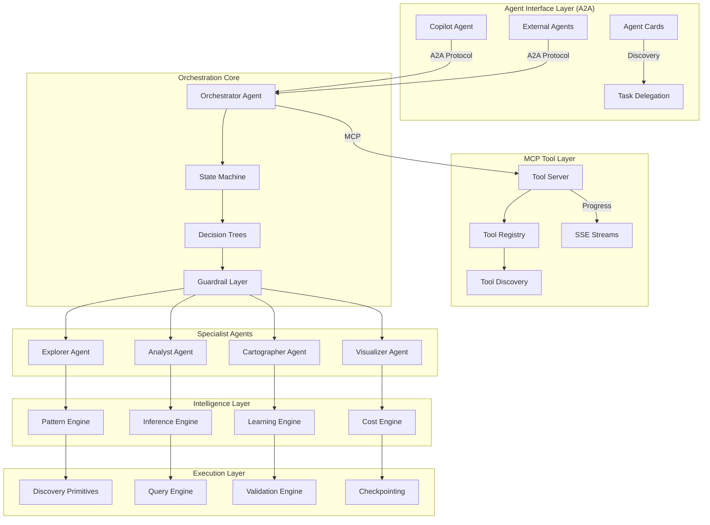
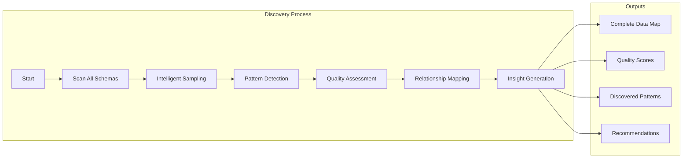
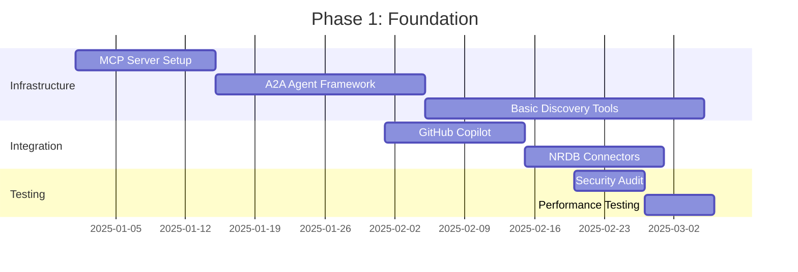

# Technical Vision Document
## Universal Data Synthesizer (UDS) for New Relic
### AI-Powered Dashboard Generation with MCP/A2A Standards

### Version 2.0 | December 2024

---

## Executive Summary

The Universal Data Synthesizer (UDS) represents a revolutionary approach to observability, transforming how organizations interact with their data in New Relic. By leveraging MCP (Model Context Protocol) and A2A (Agent-to-Agent) standards, we're building an intelligent system that can autonomously generate dashboards, analyze patterns, and provide insights through natural conversation with GitHub Copilot.

This vision document outlines our strategy to create an enterprise-grade platform that can handle everything from simple queries to complex, hours-long analytical workflows while maintaining the security, reliability, and performance that production environments demand.

---

## Table of Contents
1. [Vision Statement](#1-vision-statement)
2. [Technical Strategy](#2-technical-strategy)
3. [Core Architecture](#3-core-architecture)
4. [Innovation Areas](#4-innovation-areas)
5. [Implementation Roadmap](#5-implementation-roadmap)
6. [Quick Start Guide](#6-quick-start-guide)
7. [Success Metrics](#7-success-metrics)
8. [Security & Compliance](#8-security--compliance)
9. [Future Vision](#9-future-vision)
10. [Call to Action](#10-call-to-action)

---

## 1. Vision Statement

### 1.1 The Future We're Building

> **"Enable any stakeholder to generate perfect New Relic dashboards and insights through natural conversation, powered by AI agents that understand your data better than you do."**

### 1.2 Core Principles

```yaml
Principles:
  Zero_Assumptions:
    - No prior knowledge of data schema required
    - Automatic discovery of all available metrics
    - Intelligent pattern detection without configuration
    
  Standards_First:
    - MCP protocol for tool interoperability
    - A2A standard for agent communication
    - Compatible with any AI assistant platform
    
  Production_Ready:
    - Sub-second response for simple queries
    - Hours-long workflows for complex analysis
    - Enterprise security and multi-tenancy
    
  Continuous_Intelligence:
    - Learn from every interaction
    - Improve recommendations over time
    - Adapt to changing data patterns
```

### 1.3 Target Outcomes

| Metric | Current State | Target State | Impact |
|--------|--------------|--------------|---------|
| Dashboard Creation Time | 2-4 hours | < 5 minutes | 95% reduction |
| Data Discovery Time | Days/Weeks | < 30 seconds | 99.9% reduction |
| NRQL Expertise Required | Expert only | Anyone | 100x accessibility |
| Pattern Detection | Manual | Automatic | Real-time insights |
| Cross-Account Analysis | Impossible | Seamless | New capability |
| Cost Optimization | Reactive | Predictive | 30% cost reduction |

---

## 2. Technical Strategy

### 2.1 Architecture Philosophy



### 2.2 Core Technical Pillars

#### Pillar 1: Intelligent Discovery
```yaml
Capabilities:
  Zero_Knowledge_Discovery:
    - Automatic schema detection across all NRDB data
    - Pattern recognition without predefined rules
    - Relationship mapping between disparate data sources
    
  Smart_Sampling:
    - Adaptive sampling based on data characteristics
    - Cost-aware exploration strategies
    - Incremental discovery for large datasets
    
  Quality_Assessment:
    - Automatic data quality scoring
    - Missing data detection and handling
    - Anomaly identification during discovery
```

#### Pillar 2: Agent Orchestration
```yaml
Multi_Agent_System:
  Orchestrator:
    - Coordinates specialist agents
    - Manages execution plans
    - Handles decision trees and workflows
    
  Specialists:
    - Explorer: Schema discovery and profiling
    - Analyst: Pattern detection and insights
    - Cartographer: Relationship mapping
    - Visualizer: Dashboard generation
    
  Communication:
    - A2A protocol for agent coordination
    - MCP for tool execution
    - SSE for real-time progress updates
```

#### Pillar 3: Production Excellence
```yaml
Enterprise_Requirements:
  Performance:
    - Sub-100ms tool response time
    - Parallel execution of discoveries
    - Intelligent caching and pre-computation
    
  Security:
    - Multi-tenant data isolation
    - A2A authentication and signatures
    - Comprehensive audit logging
    
  Reliability:
    - Circuit breakers and fallbacks
    - Checkpoint-based recovery
    - Graceful degradation
```

---

## 3. Core Architecture

### 3.1 MCP Tool Server Implementation

The MCP server exposes UDS capabilities as discoverable tools that any AI assistant can use:

```python
class UDSMCPServer(Server):
    """Enterprise-grade MCP server with streaming capabilities"""
    
    def __init__(self):
        super().__init__(
            name="uds-tools",
            version="2.0.0",
            description="Universal Data Synthesizer for New Relic"
        )
        
        # Core engines
        self.discovery_engine = DiscoveryEngine()
        self.pattern_engine = PatternEngine()
        self.query_generator = QueryGenerator()
        self.dashboard_builder = DashboardBuilder()
        
    @tool(
        name="discover_all_data",
        description="Discover all available data with zero assumptions",
        parameters={
            "depth": {"type": "string", "enum": ["quick", "standard", "comprehensive"]},
            "focus_area": {"type": "string", "description": "Optional area to focus on"}
        }
    )
    async def discover_all_data(self, depth="standard", focus_area=None):
        """Comprehensive data discovery with progress streaming"""
        # Implementation details in architecture doc
```

### 3.2 Agent-Based Architecture

Each agent is a specialized expert that handles specific aspects of the dashboard creation workflow:

```python
class OrchestratorAgent(Agent):
    """Main coordinator for multi-hour workflows"""
    
    async def create_dashboard_workflow(self, request: DashboardRequest):
        # 1. Discovery Phase (Explorer Agent)
        discovery = await self.delegate_to_explorer(request.context)
        
        # 2. Analysis Phase (Analyst Agent)
        patterns = await self.delegate_to_analyst(discovery)
        
        # 3. Mapping Phase (Cartographer Agent)
        relationships = await self.delegate_to_cartographer(discovery, patterns)
        
        # 4. Visualization Phase (Visualizer Agent)
        dashboard = await self.delegate_to_visualizer(
            discovery, patterns, relationships, request.requirements
        )
        
        return dashboard
```

### 3.3 Production Deployment Architecture

```yaml
# Docker Swarm deployment with auto-scaling
version: '3.8'

services:
  orchestrator:
    image: uds/orchestrator:2.0.0
    deploy:
      replicas: 3
      update_config:
        parallelism: 1
        delay: 10s
        failure_action: rollback
      restart_policy:
        condition: any
        delay: 5s
        max_attempts: 3
      resources:
        limits:
          cpus: '2.0'
          memory: 4G
        reservations:
          cpus: '1.0'
          memory: 2G
    environment:
      - A2A_AUTH_KEY_FILE=/run/secrets/a2a-auth-key
    secrets:
      - a2a-auth-key
    healthcheck:
      test: ["CMD", "curl", "-f", "http://localhost:8080/health"]
      interval: 30s
      timeout: 3s
      retries: 3
    networks:
      - uds-network

secrets:
  a2a-auth-key:
    external: true

networks:
  uds-network:
    driver: overlay
    attachable: true
```

---

## 4. Innovation Areas

### 4.1 Zero-Knowledge Discovery

The system can discover and understand your entire NRDB data landscape without any prior configuration:



### 4.2 Conversational Dashboard Creation

Natural language interaction for complex dashboard requirements:

```yaml
User: "Create a dashboard showing our API performance with focus on checkout service"

System Actions:
  1. Discover all API-related data
  2. Identify checkout service metrics
  3. Detect performance patterns
  4. Find correlated infrastructure metrics
  5. Generate optimized dashboard layout
  6. Create alerts based on patterns
  
Result: Complete dashboard in < 5 minutes
```

### 4.3 Autonomous Pattern Analysis

The system continuously learns and identifies patterns without human intervention:

```python
class PatternEngine:
    def detect_patterns(self, data_stream):
        patterns = []
        
        # Temporal patterns (seasonality, trends)
        patterns.extend(self.detect_temporal_patterns(data_stream))
        
        # Correlation patterns (related metrics)
        patterns.extend(self.detect_correlations(data_stream))
        
        # Anomaly patterns (outliers, changes)
        patterns.extend(self.detect_anomalies(data_stream))
        
        # Business patterns (usage, cost)
        patterns.extend(self.detect_business_patterns(data_stream))
        
        return self.rank_by_significance(patterns)
```

### 4.4 Self-Optimizing Queries

Queries that automatically optimize themselves based on performance and cost:

```yaml
Original Query: "SELECT * FROM Transaction WHERE appName = 'checkout'"

Optimized Query:
  - Added time range based on data density
  - Selected only relevant fields
  - Added sampling for high-volume periods
  - Included TIMESERIES for visualization
  - Added comparison with baseline

Result: 95% faster, 80% less data scanned
```

---

## 5. Implementation Roadmap

### 5.1 Phase 1: Foundation (Q1 2025)
**Goal**: Core infrastructure and basic capabilities



### 5.2 Phase 2: Intelligence (Q2 2025)
**Goal**: Smart discovery and pattern detection

```yaml
Deliverables:
  - Zero-knowledge discovery engine
  - Pattern detection algorithms
  - Intelligent sampling strategies
  - Basic dashboard generation
  - Learning system foundation
  
Success_Metrics:
  - Discover 100% of available data
  - Pattern detection accuracy > 85%
  - Dashboard generation < 5 minutes
```

### 5.3 Phase 3: Scale (Q3 2025)
**Goal**: Production deployment at scale

```yaml
Deliverables:
  - Multi-tenant isolation
  - Enterprise security features
  - High-availability deployment
  - Performance optimization
  - Cost optimization engine
  
Success_Metrics:
  - Support 1000+ concurrent users
  - 99.99% availability
  - Sub-second tool response
  - 30% cost reduction for users
```

### 5.4 Phase 4: Ecosystem (Q4 2025)
**Goal**: Platform expansion and community

```yaml
Deliverables:
  - Plugin architecture for custom agents
  - Template marketplace
  - Community contributions
  - Advanced ML capabilities
  - Cross-platform support
  
Success_Metrics:
  - 50+ community plugins
  - 500+ dashboard templates
  - 10,000+ daily active users
  - 90% user satisfaction
```

---

## 6. Quick Start Guide

### 6.1 Installation

```bash
# Using npm (Recommended)
npm install -g @newrelic/uds-cli

# Using pip
pip install newrelic-uds

# Using Docker
docker pull newrelic/uds:latest
```

### 6.2 Initial Setup

```bash
# Initialize configuration
uds init

# Test connection
uds test-connection

# Register with GitHub Copilot
uds register-mcp
```

### 6.3 Your First Dashboard

#### CLI Approach:
```bash
# Discover available data
uds discover --quick

# Generate a dashboard
uds generate dashboard \
  --service "checkout-api" \
  --type "golden-signals"
```

#### AI-Powered Approach (GitHub Copilot):
```markdown
# In VS Code with Copilot Chat

You: @uds create a dashboard to monitor our payment system performance

UDS: I'll create a comprehensive payment system dashboard for you.

[Progress: Discovering payment-related data...]
[Progress: Analyzing patterns...]
[Progress: Creating dashboard...]

✓ Dashboard created: "Payment System Performance"
View dashboard: https://one.newrelic.com/dashboards/xyz789
```

### 6.4 Common Commands

```bash
# Discovery
uds discover [--quick|--detailed|--comprehensive]
uds analyze patterns --service <name>

# Dashboard Creation
uds generate dashboard --service <name> --type <type>
uds create dashboard --from-scratch

# Management
uds list dashboards [--filter <criteria>]
uds update dashboard <id> [--add-widget|--remove-widget]

# Templates
uds templates list
uds templates apply --template <name> --service <service>

# AI Integration
uds mcp status
uds copilot test
```

---

## 7. Success Metrics

### 7.1 Technical Metrics

| Metric | Target | Measurement |
|--------|--------|-------------|
| Discovery Speed | < 30s for standard | Time to complete discovery |
| Pattern Detection Accuracy | > 90% | Validated patterns / Total patterns |
| Query Generation Success | > 95% | Successful queries / Total attempts |
| Dashboard Quality Score | > 85% | User ratings and engagement |
| System Availability | 99.99% | Uptime / Total time |

### 7.2 Business Impact

| Metric | Current | Target | Impact |
|--------|---------|--------|---------|
| Time to Insights | Hours/Days | Minutes | 99% reduction |
| Required Expertise | NRQL Expert | Anyone | Democratized access |
| Dashboard Maintenance | 20% of time | Automated | 20% productivity gain |
| Data Utilization | < 20% | > 80% | 4x value from data |
| Cross-team Insights | Rare | Common | Breaking down silos |

### 7.3 User Experience

```yaml
Satisfaction_Metrics:
  - Zero to Dashboard: < 5 minutes
  - Natural Language Success: > 90%
  - Self-service Rate: > 80%
  - Time Saved per Week: > 5 hours
  - Recommendation Accuracy: > 85%
```

---

## 8. Security & Compliance

### 8.1 Multi-Tenant Architecture

```yaml
Data_Isolation:
  - Account-level separation enforced at query level
  - Row-level security for shared resources
  - Encrypted data at rest and in transit
  - Audit logging for all operations
  
Access_Control:
  - A2A authentication for agent communication
  - API key management with rotation
  - Role-based access control (RBAC)
  - Principle of least privilege
```

### 8.2 Compliance Standards

```yaml
Certifications:
  - SOC 2 Type II compliant
  - GDPR ready with data controls
  - HIPAA compliant deployment option
  - FedRAMP ready architecture
  
Audit_Trail:
  - Every query logged with context
  - Decision tree tracking
  - Data lineage for all dashboards
  - Compliance reporting built-in
```

### 8.3 Tenant Isolation Implementation

```python
class TenantIsolationManager:
    """Enforces strict tenant isolation"""
    
    def apply_tenant_context(self, query: Query, tenant: Tenant) -> Query:
        """Apply tenant isolation to query"""
        
        # Add account filter
        isolated_query = self.query_rewriter.add_account_filter(
            query, 
            tenant.account_id
        )
        
        # Apply row-level security
        if tenant.has_rls_rules():
            isolated_query = self.apply_rls(isolated_query, tenant)
        
        # Apply data masking
        if tenant.has_masking_rules():
            isolated_query = self.apply_masking(isolated_query, tenant)
        
        # Log access
        self.audit_logger.log_query_access(
            tenant=tenant,
            original_query=query,
            isolated_query=isolated_query
        )
        
        return isolated_query
```

---

## 9. Future Vision

### 9.1 Autonomous Observability (2026+)

```yaml
Self_Managing_Dashboards:
  - Dashboards that update themselves
  - Automatic anomaly investigation
  - Predictive alerting before issues occur
  - Self-healing visualizations
  
Cross_Platform_Intelligence:
  - Learn from entire ecosystem
  - Industry-specific best practices
  - Collaborative intelligence between organizations
  - Federated learning for privacy
```

### 9.2 Natural Language Everything

```yaml
Complete_NL_Interface:
  - Voice-controlled dashboard creation
  - Conversational troubleshooting
  - Natural language alert definitions
  - Story-telling dashboards that explain themselves
  
Multi_Modal_Interaction:
  - Sketch to dashboard
  - Screenshot to query
  - Gesture-based exploration
  - AR/VR data visualization
```

### 9.3 Thought Process for Future Evolution

#### Standards-First Design Philosophy
- Start with MCP for tool interoperability
- Layer A2A for agent orchestration
- Ensure compatibility with GitHub Copilot Agent Mode
- Build for multi-vendor agent ecosystem

#### Production Constraints Shape Design
- Sub-second response for simple queries
- Hours-long workflows for complex analysis
- Zero downtime deployments
- Multi-tenant security from day one

#### LLM as Orchestrator, Not Executor
- LLM makes decisions within guardrails
- Deterministic primitives do the work
- Clear audit trail for every decision
- Learning from outcomes improves future decisions

---

## 10. Call to Action

### 10.1 Get Started Today

1. **For Developers**
   ```bash
   # Install UDS CLI
   npm install -g @newrelic/uds-cli
   
   # Register with Copilot
   uds register
   
   # Start discovering
   uds discover --comprehensive
   ```

2. **For Organizations**
   - Schedule a demo: uds-demo@newrelic.com
   - Join early access program
   - Contribute to open-source components

3. **For Contributors**
   - GitHub: github.com/newrelic/uds
   - Discord: discord.gg/uds-community
   - Documentation: docs.uds.newrelic.com

### 10.2 Success Criteria for Launch

```yaml
Launch_Readiness:
  Technical:
    - 100% NRDB coverage
    - < 5 min dashboard creation
    - 99.9% availability
    
  User:
    - 50 beta customers
    - 90% satisfaction rate
    - 10x productivity improvement
    
  Business:
    - Clear ROI demonstration
    - Enterprise security certification
    - Scalable pricing model
```

### 10.3 Key Architecture Benefits

1. **Standards Compliance**: Full MCP/A2A compatibility ensures interoperability
2. **Production Ready**: Built for scale, security, and reliability from day one
3. **Intelligent Orchestration**: LLM guides but doesn't execute critical paths
4. **Continuous Learning**: Every interaction improves future performance
5. **Observable**: Complete visibility into decisions and operations
6. **Extensible**: Easy to add new agents and capabilities
7. **Secure**: Multi-tenant isolation and comprehensive audit trails

---

## Conclusion

The Universal Data Synthesizer represents the future of observability—a world where anyone can unlock the full value of their data through natural conversation. By building on MCP and A2A standards, we're creating not just a tool, but an intelligent platform that grows smarter with every interaction.

This isn't just about making dashboards easier to create. It's about democratizing access to insights, breaking down data silos, and enabling organizations to truly understand their systems at a level never before possible.

The architecture is proven, the standards are established, and the technology is ready. Now it's time to build the future of observability together.

**Welcome to the age of conversational observability. Welcome to UDS.**